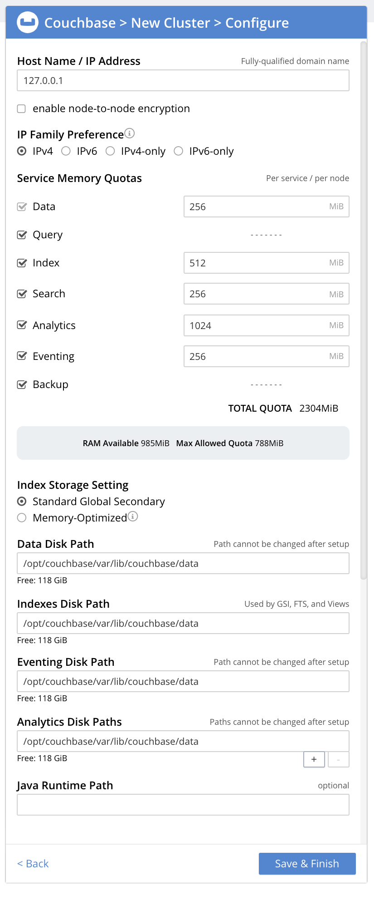
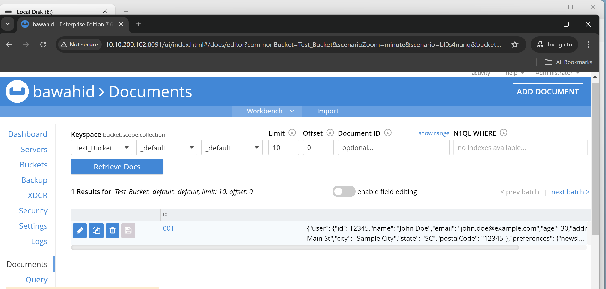

# Couchbase Server & Sync Gateway

Couchbase is the modern database for enterprise applications.
Couchbase Server is an open source, distributed, JSON document database. It exposes a scale-out, key-value store with managed cache for sub-millisecond data operations, purpose-built indexers for efficient queries, and a powerful query engine for executing SQL-like queries. For mobile and Internet of Things environments Couchbase also runs natively on-device and manages synchronization to the server

Sync Gateway is the synchronization server in a Couchbase Mobile deployment. It is designed to provide data synchronization for large-scale interactive web, mobile, and IoT applications.

Couchbase Mobile is a comprehensive solution for building offline-first, distributed mobile and edge applications. It is designed to provide seamless data synchronization, offline capabilities, and secure data storage across mobile devices and backend infrastructure. The Couchbase Mobile stack consists of three main components: Couchbase Lite, Sync Gateway, and Couchbase Server.


## Working Model

 Couchbase and Sync Gateway are components of the Couchbase Mobile ecosystem that work together to provide a robust solution for data management, synchronization, and access control in mobile and web applications. Here's a detailed overview of how they work together

 ## Couchbase Server

Couchbase Server is a NoSQL database designed for high performance and scalability. It is used as the backend database to store and manage data. Key features include:

Sync Gateway is the synchronization server in a Couchbase Mobile deployment. It is designed to provide data synchronization for large-scale interactive web, mobile, and IoT applications — see
 

 ![Alt Text][def]

[def]: couchbase/cb-model.png

1. Distributed Architecture:
    
    Couchbase Server operates in a distributed manner, allowing data to be spread across multiple nodes. This ensures high availability, fault tolerance, and scalability.

2.  Data Model:

    It uses a document-oriented data model, storing data in JSON format. This provides flexibility in handling different types of data and schema changes.

3.  High Availability:

    Features such as automatic failover and replication ensure that data remains available and consistent even in the event of hardware failures.

## Sync Gateway

Sync Gateway is a component that facilitates data synchronization between Couchbase Server and Couchbase Lite (the mobile database). It is responsible for:

1. Data Synchronization:

   sync Gateway enables bidirectional synchronization between Couchbase Server and Couchbase Lite, which is used on mobile devices and web apps. This means changes made on mobile devices are replicated to the server and vice versa, ensuring consistency across all devices.

2. Sync Function:

   The sync function, written in JavaScript, defines the logic for how documents should be synchronized. It includes rules for data access, routing, and conflict resolution.

3. Access Control:

   Sync Gateway enforces security policies, controlling which users and devices can access or modify specific data. It supports various authentication methods and can be configured to use custom authentication providers.

4. REST API:

   Sync Gateway provides a RESTful API that allows applications to interact with the database over HTTP. This API is used for operations such as creating, updating, querying, and deleting documents.

5.  Offline Support:

    It supports offline-first scenarios, allowing applications to work even without a network connection. Couchbase Lite on the client stores data locally and synchronizes with Sync Gateway when the connection is restored.


## How Couchbase Server and Sync Gateway Work together

1. Data Storage:

   Couchbase Server acts as the central repository for data. Sync Gateway connects to Couchbase Server to retrieve and store data.

2. Synchronization:

   Sync Gateway manages the synchronization process between Couchbase Server and Couchbase Lite. It ensures that changes made on mobile devices are propagated to the server and vice versa.
3. Access Control and Security:
  
  Sync Gateway enforces security policies and access control to protect data and ensure that only authorized users and devices can access or modify it.

4. Real-time Updates:
    
    Both Couchbase Server and Sync Gateway are designed to handle real-time updates and maintain data consistency across distributed systems.

    

## Installation

For docker installation.

```
#Docker installation in Ubuntu 22.04

sudo apt-get update

sudo apt install apt-transport-https ca-certificates curl software-properties-common
curl -fsSL https://download.docker.com/linux/ubuntu/gpg | sudo gpg --dearmor -o /usr/share/keyrings/docker-archive-keyring.gpg
echo "deb [arch=$(dpkg --print-architecture) signed-by=/usr/share/keyrings/docker-archive-keyring.gpg] https://download.docker.com/linux/ubuntu $(lsb_release -cs) stable" | sudo tee /etc/apt/sources.list.d/docker.list > /dev/null
sudo apt update
sudo apt install docker-ce docker-ce-cli containerd.io
sudo systemctl start docker
sudo systemctl enable docker
sudo usermod -aG docker $USER

```
## couchbase & syncgateway run the container
```
cd android-kotlin-cbl-learning-path-main
# run the container
docker compose up -d
#show the running container
docker ps -a
#to stop docker container
docker stop <container id>
#to remove docker container
docker rm <container id>
#for start container again
docker compose up -d

```


Couchbase Server can be deployed on a variety of platforms, from traditional bare metal servers, to containers running in a public or private cloud.


[Alt Text](couchbase/server-installation.png)

Hardware requirements:

CPU requirements : SSE4.2 extensions
[N.B - without it bucket is in the pending state]
Node: Minimum: 1 node (3 nodes recommended for redundancy).

Check CPU Extention avilablity


```
$ lscpu | grep sse4_2
$ grep sse4_2 /proc/cpuinfo

```


## Create a Cluster

 A new Couchbase Server node can be provisioned, to establish its Full Administrator credentials, its service-assignments, and its memory quotas. At this point, it becomes a cluster of one node

 ## Step-1

According to this docker compose file couchbase server and sync-gateway's two container up on the server.

 Provision a Node with the UI

 Couchbase Web Console is, by default, available on port 8091. Therefore, once Couchbase Server has been installed on a server, the console can be accessed over the network at http://<server-ip-address>:8091/ or http://<server-hostname>:8091/. It can be accessed from the machine on which Couchbase Server was installed at http://localhost:8091.

 One or more instances of Couchbase Server constitute a cluster, which replicates data across server-instances, and across clusters; and so ensures high availability.

Clusters Once you have connected, the Welcome screen appears:


 [Alt Text](couchbase/welcome-screen.png)


You can  Setup New Cluster, or Join Existing Cluster.

To set up a new cluster, left-click on Setup New Cluster.The New Cluster screen now appears, as follows:


Cluster Name: Your choice of name for the cluster to be created. For information on cluster-naming.

Create Admin Username: Your choice of username, for yourself: the Full Administrator for this cluster. You will have read-write access to all Couchbase Server resources; including the ability to create new users with defined roles and corresponding privileges.

Create Password: Your choice of password, for yourself: the Full Administrator for this cluster.

Accept Terms and Register for Updates


 if you wish to customize those settings, left-click on the Configure Disk, Memory, Services button, and proceed as follows. Configure Couchbase Server.

 
 


 When you have finished entering your configuration-details, left-click on the Save & Finish button, at the lower right. This configures the server accordingly, and brings up the Couchbase Web Console Dashboard, for the first time.


 


 ## Step-2
 New-Cluster Set-Up: Next Steps.

 If this is the first server in the cluster, a notification appears, stating that no buckets are currently defined. A bucket is the principal unit of data-storage used by Couchbase Server. In order to save and subsequently access documents and other objects, you must create one or more buckets.

 The buckets that you create must be accessed securely.Each administrator and application is considered to be a user, and must perform bucket-access by passing a username and password.

 For user and role creation below type:


After sussesfully creating a bucket any name , we create two buckets including projets and test.
Below the type of buckets and resource .During bucket creation must assinging role of the user of the bucket .To access the full bucket select * in bucket user role.


Then create user and give the user full admin permission for whole access and select bucket and give astric to full access to to bucket and then go to mobile and sync-gateway select belows this:


After creating bucket,we can upload data in a json documents selecting documents in bucket and add documents.And we upload data in json format.If we want,can easily remove bucket by drop bucket selection and remove the documents file.





we also backup the bucket data.But if we want to backup the bucket data click on backup and add a repository for a select a plan which i backup select for hourly basis backub or daily basis backup.Then click next button.After that comes a create repository plan pop up and fill the all uniq id name for repository,bucket name which i backup, storage file system, location in backup data,and  click add button.Finally create a repository for backup.


(For backup , install cbbackupmgr CLI utility in shell.)

In GUI mode A number of buttons now appear, arranged horizontally across the bottom of the row, permitting a variety of actions. To perform an immediate backup, left-click on the Run Backup button:and backup starting.


Finally goto dashboard and check the bucket whole information ,node information according to this given figure:


After successfully creating a so many bucket we can easily upload document in json format. we can Monitor the couchbase server resource from dashboard page as below:


In summary, Couchbase Server provides the backend infrastructure for storing and managing data, while Sync Gateway handles the synchronization and access control between Couchbase Server and mobile/web clients, ensuring data consistency and security.


## step-3 How To take couchbase bucket backup

step-1: Enter into the cousebase container & make a directory where you want to backup and a repository for archive.
 ```
 mkdir -p /opt/couchbase/backups
 cd /opt/couchbase/bin
 ```

```
/opt/couchbase/bin/cbbackupmgr config \
  --archive /opt/couchbase/backups \
  --repo cousebase_bakup
```
step-2: Then Run second command to full backup for icommune bucket. This take full bucket backet with logs.

```
cd /opt/couchbase/bin/

  cbbackupmgr backup \
  --archive /opt/couchbase/backups \
  --repo cousebase_bakup \
  --cluster couchbase://192.168.224.2 \
  --username <user-name> \
  --password '<user-pass>' \
  --full-backup
```
step-3: Then copy to the host vm outside the container.Run below this command.
```
docker cp couchbase-server:/opt/couchbase/backups /home/wahid/cousebase-backup
```
## step-4: Couchbase full bucket restore method

step-1: At first to store the full bucket ,you go to your home directory and place the bucket data.and run this command

```

docker cp /home/wahid/backup_bucket/cousebase-backup.zip couchbase-server:/opt/couchbase/backups/
explain:
docker cp /home/<your directory>/<bucket_data> couchbase-server:/opt/couchbase/<make folder inside the couchbase containr>
```
step-2: Then login to the container and run this command 

```
cd /opt/couchbase/bin
#At first enter into the cousebase container then run this command
/opt/couchbase/bin/cbbackupmgr restore \
  --archive /opt/couchbase/backups/cousebase-backup/backups \
  --repo cousebase_bakup \
  --cluster couchbase://192.168.224.2 \
  --username admin \
  --password '<pass>' \
  --include-data icommune \
  --enable-bucket-config \
  --force-updates
```
  if fail then run second command
```
#if restore fail during process
/opt/couchbase/bin/cbbackupmgr restore \
  --archive /opt/couchbase/backups/cousebase-backup/backups \
  --repo cousebase_bakup \
  --cluster couchbase://192.168.224.2 \
  --username admin \
  --password '<pass>>' \
  --include-data icommune \
  --enable-bucket-config \
  --force-updates \
  --resume
```
